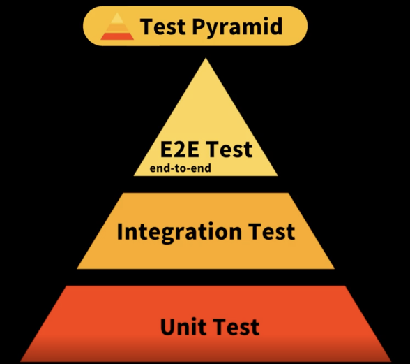

# 테스트

- 유닛(단위)테스트(JEST)와 TDD
- Jest와 RTL을 이용해 리액트 컴포넌트 테스트하기

### 장점

- 기능이 정상 동작하는지 확인
- 요구 사항 만족
- 이슈에 대해 예측
- 버그를 빠르게 발견
- 손쉬운 유지 보수
- 코드의 품질 향상
- 코드간 의존성을 낮춤
- 좋은 문서화
- 시간을 절약

## 테스트 피라미드

1. Unit Test (단위 테스트)
2. Integration Test (통합 테스트)
3. E2E(End-to-End) Test (=사용자 테스트, UI 테스트)

## TOOL

- `Jest`
