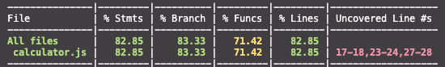

# JEST

JS환경에서 테스트를 할 수 있는 프레임워크
[공식문서](https://jestjs.io/docs/getting-started)

### 시작하기

```shell
sudo npm i jest --global // golbal로 설치
jest --init // jest.config.js 파일 생성
npm i --save-dev jest // 동일한 환경을 유지하기 위해 local로 재설치
npm i @types/jest // 타입 설치
npm run test // 실행
```

### 자동 환경 설정

`package.json` 파일에서

```json
  "scripts": {
    "test": "jest --watchAll"
  },
```

설정 시 반복적으로 실행 가능하다.

그리고 깃에 커밋된 파일은 제외하고 실행하고 싶은 경우

```json
  "scripts": {
    "test": "jest --watch"
  },
```

를 설정할 수 있다.

### error



jest는 다음과 같이 Uncovered Line를 통해 아직 해결하지 못한 에러 라인을 알려준다.

### 비동기 테스트 하기

[비동기 테스트 하기 코드](../src/basic/test/async.test.js)
[문서에서 더 알아보기](https://jestjs.io/docs/asynchronous)

### mock

[비동기 테스트 하기 코드](../src/mock/check/test/check.test.js)
[문서에서 더 알아보기](https://jestjs.io/docs/mock-functions)

### mocak과 stub

../mock/product 폴더 참조하기

[mock을 사용한 것은 안 좋은 코드](../src/mock/product/product_service_no_di.js) -> [stub을 사용하는 것이 좋은 코드](../src/mock/product/test/product_service.test.js)

### mock를 이용한 사용자 로그인 테스트

../mock/user 폴더 참조하기
